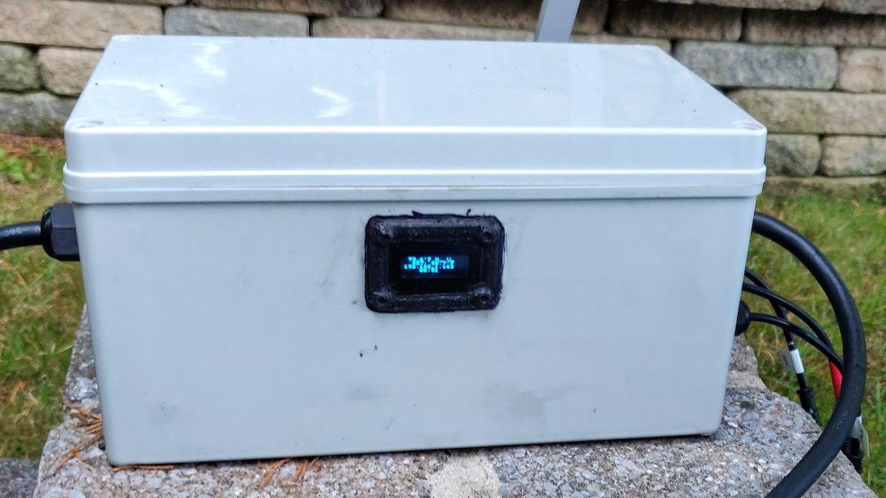

> **WARNING!!**  &nbsp; As you can probably tell from the messiness of the code, this is a quick hack 
> and most of this is throw-away code written in a hurry, for my personal use... you have been warned!

# poolstat

Experimental MQTT datalogger and remote control, for fooling around with a small inflatable pool.
Hardcoded inputs are two thermistors and a simple water level indicator, and outputs are relay and solenoid valve.

The software is probably not very useful without the hardware setup; the finished enclosure looks something like this:

I did not expect the enclosure to be the most time-consuming part of the build (more so than the software). However, once I started, I realized that I hadn't considered certain aspects, especially ensuring that (i) all modifications are weatherproof (in particular, the display window was tricky, using RTV and custom gasketing, and in retrospect, I'd have not done this), and (ii) it's safe for 110V and the SSR is adequately cooled (which involved building a separate sheet-metal sub-enclosure with large heatsink, all fully bonded to ground, and protected by a redundant, inline GFCI breaker).  

I will **not** be releasing any details about the enclosure.  Although I'm reasonably confident about it's design for my use, I am neither an electrical engineer, nor do I wish to be held even remotely responsible for any electrocutions (which, in this application, are _quite_ likely, especially if you do not understand what you are doing). :)